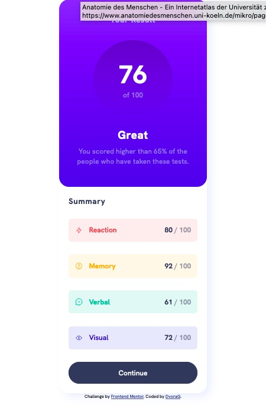
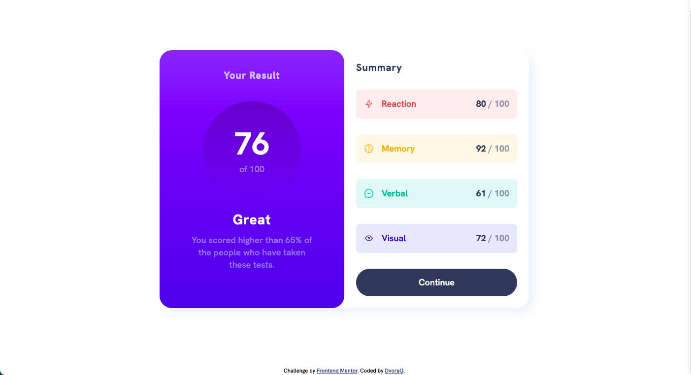
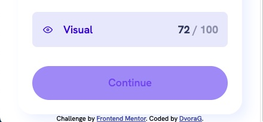
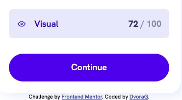

# Frontend Mentor - Results summary component solution

This is a solution to the [Results summary component challenge on Frontend Mentor](https://www.frontendmentor.io/challenges/results-summary-component-CE_K6s0maV). Frontend Mentor challenges help you improve your coding skills by building realistic projects.

## Table of contents

- [Overview](#overview)
  - [The challenge](#the-challenge)
  - [Screenshot](#screenshot)
  - [Links](#links)
- [My process](#my-process)
  - [Built with](#built-with)
  - [What I learned](#what-i-learned)
  - [Continued development](#continued-development)
  - [Useful resources](#useful-resources)
- [Author](#author)
- [Acknowledgments](#acknowledgments)

**Note: Delete this note and update the table of contents based on what sections you keep.**

## Overview

### The challenge

The above challenge is to display a total score in a colored part and the results in each test unit.
A button is set at the screen bottom to continue to a different part of the app. The button has three states: regular, hover and active.

### Screenshot

#### The differen button states

### Links

- Solution URL: (https://github.com/DvoraG/results-summary-component)

- Live Site URL: (https://dvorag.github.io/results-summary-component/)

## My process

### Built with

- Semantic HTML5 markup
- CSS custom properties
- Flexbox
- CSS Grid
- Mobile-first workflow

### What I learned

After learning HTML5 and CSS3 my major challenges where:

- When to use grid or when to use flex?
- Grouping
- padding, merge

This challenge was really good for me to get a good understanding for the above.

### Continued development

My big goal is to going from simple HTML and CSS to build react and gatsby based webapps.

## Author

- Frontend Mentor - [@DvoraG](https://www.frontendmentor.io/profile/DvoraG)

## Acknowledgments

I usually go to search for solutions on YouTube.
These are the three channels I use the most:

https://www.youtube.com/@CodingAddict
John Smilga is a really great teacher. Great tutorials!

https://www.youtube.com/@KevinPowell
Kevin Powell presents a lot of cool snippets that are very helpful.

https://www.youtube.com/@WebDevSimplified
Also great for code snippets!
